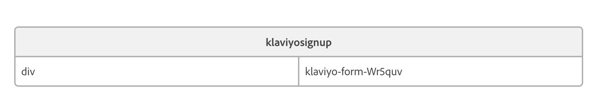

# Klaviyo Signup Block for Adobe Commerce Storefront

This repository contains the code for custom block that can be used in Adobe Commerce Storefront DA authoring.

## Requirements

1. Klaviyo Onsite javascript must already be added in the head

## Installation instructions

1. CD to you Adobe Commerce Storefront's ```*rootFolder/blocks```
2. clone https://github.com/abovethefray/klaviyo-signup-block-for-adobe-commerce-storefront
   - ```bash
     git clone git@github.com:abovethefray/klaviyo-signup-block-for-adobe-commerce-storefront.git
     ```
3. Rename the cloned klaviyo-signup-block-for-adobe-commerce-storefront folder to klaviyosignup
4. Head to DA authoring and select any page. In this case, homepage. 
5. Insert a block with format

   - fist column should be fix "div" value.
   - second column will the form identifer given in the Klaviyo admin signup form creation.
6. publish the page and test storefront

> [!NOTE]
> If you localhost is not secured (http://localhost:300/) form submit will not work.